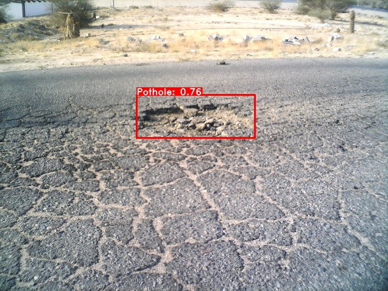

# Graduation-Project-II-SALIK-SYSTEM- 🐱‍🏍
An automated system to detect and alert potential road damages and obstacles.



# Pothole Detection, Tracking, and SMS Alert System 🔔

This Python script implements a system for detecting and tracking potholes in a video stream using the YOLOv8 model and sending SMS alerts with pothole information. It utilizes the Ultralytics YOLO framework for object detection and the imgBB API for hosting images. 

## Features

- Real-time pothole detection and tracking in a video stream.📹
- Sending SMS alerts with pothole information including image links.📲
- Multiple processes for sending SMS alerts in parallel.⚡
- SMS cooldown period to prevent repeated alerts for the same pothole.🚧
- Utilizes YOLOv8 for object detection with a customizable detection threshold.🔎
- Object tracking to maintain continuity for detected potholes.🕳
- GPS-based location information retrieval and Google Maps link generation.📍

## Installation and Setup

1. Install the required Python packages:

   ```bash
   pip install -r requirements.txt


2. Obtain API keys and update the code:

- Get an API key from imgBB for image hosting and update api_key in the code.
- Set your SMS Gateway URL, API ID, API password, and other SMS parameters.
- Update class_names to match the classes recognized by your YOLO model.

## Dependencies
- Ultralytics YOLO
- imgBB API
- OpenCV
- Geocoder
- Requests
- Multiprocessing


